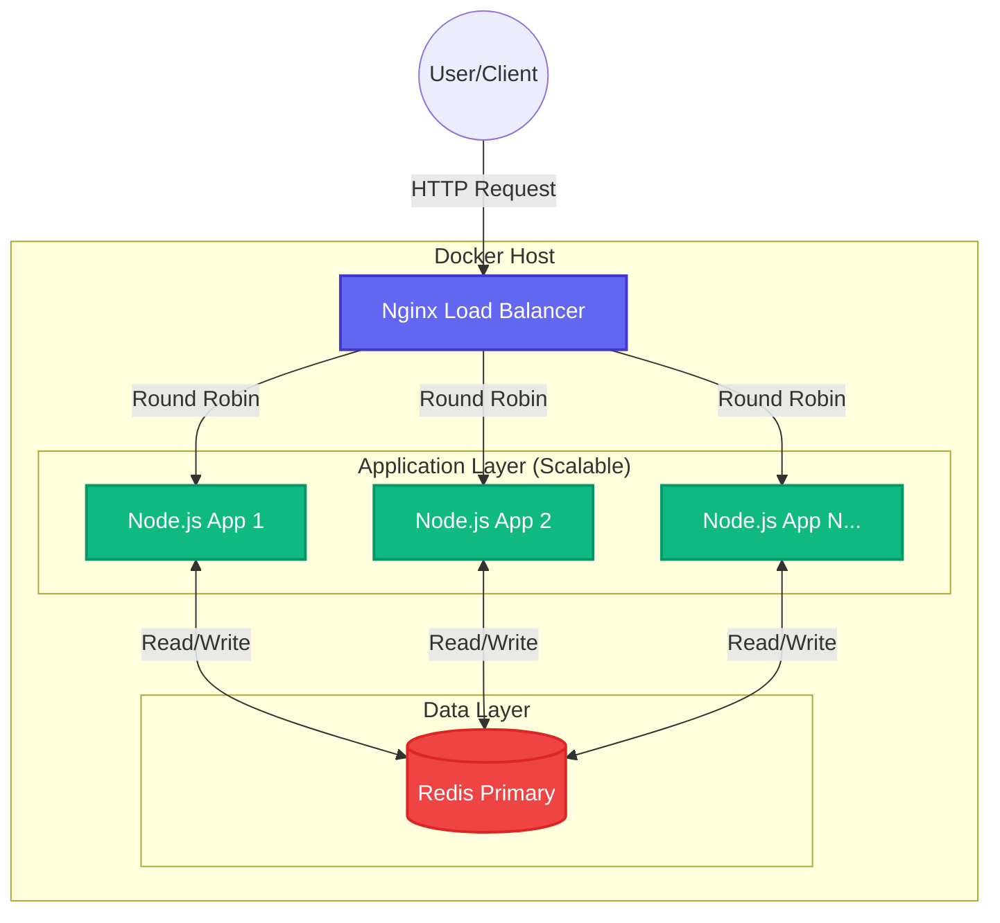

# QuickVote - Scalable Voting System

Platform voting real-time yang handal dan scalable. Dibangun dengan Node.js, Redis, Nginx, dan Docker untuk menangani beban tinggi dengan performa maksimal.

## 🚀 Tech Stack

- **Frontend**: HTML5, Vanilla JavaScript, Tailwind CSS
- **Backend**: Node.js, Express.js
- **Database**: Redis (in-memory)
- **Load Balancer**: Nginx
- **Containerization**: Docker, Docker Compose

## 🏗️ Architecture Design

Sistem ini didesain dengan prinsip **Microservices Architecture** untuk menjamin scalability dan high availability.



### Design Principles:
1.  **Scalable**: Stateless Application Layer memungkinkan kita menambah container (`--scale app=N`) tanpa batas.
2.  **Reliable**: Redis dengan AOF Persistence menjamin data tidak hilang meski container restart.
3.  **Secure**: 
    - Nginx sebagai Reverse Proxy menyembunyikan detail aplikasi.
    - Rate Limiting (bisa dikonfigurasi di Nginx).
    - Server-side Authentication untuk aksi sensitif.

## 📁 Project Structure

```
Quick_vote/
├── app/
│   ├── public/
│   │   ├── index.html      # Landing page
│   │   ├── admin.html      # Admin panel
│   │   └── vote.html       # Public voting page
│   ├── server.js           # Express server
│   ├── package.json
│   └── Dockerfile
├── nginx/
│   └── nginx.conf          # Load balancer config
├── docker-compose.yml
└── README.md
```

## 🎯 Features

### Core Features
- ✅ **Real-time Voting**: Hasil voting terupdate secara real-time
- ✅ **Email Validation**: Satu email = satu vote (no double voting)
- ✅ **Admin Panel**: Create, start, stop, dan delete voting
- ✅ **Live Results**: Circular chart dengan percentage breakdown
- ✅ **Responsive Design**: Mobile-friendly interface

### Scalability Features
- ✅ **Horizontal Scaling**: Scale app containers dengan `--scale app=N`
- ✅ **Load Balancing**: Nginx distribute traffic ke multiple containers
- ✅ **Redis Persistence**: Data tidak hilang saat restart
- ✅ **Container Health Check**: Monitor container status
- ✅ **Atomic Operations**: Thread-safe vote counting

## 🔧 Installation

### Prerequisites
- Docker Desktop (Windows/Mac) atau Docker Engine (Linux)
- Docker Compose
- Port 80 dan 6379 harus available

### Quick Start

1. **Clone repository**
```bash
git clone <repository-url>
cd Quick_vote
```

2. **Start dengan 1 container** (Development)
```bash
docker compose up --build
```

3. **Start dengan multiple containers** (Production)
```bash
docker compose up --build --scale app=3 -d
```

4. **Akses aplikasi**
- Landing Page: http://localhost
- Admin Panel: http://localhost/admin.html (password: `admin123`)
- Voting Page: http://localhost/vote.html

## 📊 Testing Scalability

### Test 1: Start dengan 1 container
```bash
docker compose up --build
```
Akses http://localhost/api/health → Lihat container ID

### Test 2: Scale ke 3 containers
```bash
docker compose up --scale app=3 -d
```
Refresh http://localhost/api/health beberapa kali → Container ID berubah (load balanced!)

### Test 3: Scale ke 5 containers
```bash
docker compose up --scale app=5 -d
```

### Test 4: Monitor containers
```bash
docker compose ps
docker compose logs app
```

### Test 5: Stop 1 container (Reliability Test)
```bash
docker ps  # Lihat container IDs
docker stop <container-id>
```
Aplikasi tetap jalan dengan containers lainnya!

## 🔐 Admin Panel Usage

1. **Buka Admin Panel**: http://localhost/admin.html
2. **Login**: Password = `admin123`
3. **Create Voting**:
   - Masukkan judul voting (e.g., "Pemilihan Ketua OSIS 2024")
   - Tambah kandidat (minimal 2):
     - Icon/Emoji (e.g., 👨‍💼, 👩‍💼)
     - Nama kandidat
     - Deskripsi (optional)
   - Klik "Simpan Voting"
4. **Start Voting**: Klik "Mulai Voting" → Link voting tersedia
5. **Share Link**: Copy link dan bagikan ke voters
6. **Monitor Results**: Lihat hasil real-time
7. **Stop Voting**: Klik "Stop Voting" saat selesai
8. **Delete**: Hapus voting untuk membuat yang baru

## 🗳️ Voting Flow (Public)

1. User akses http://localhost/vote.html
2. Pilih kandidat
3. Masukkan email untuk konfirmasi
4. Submit vote
5. Lihat hasil real-time di chart

## 📈 Load Testing (Optional)

Gunakan Apache Bench atau k6 untuk load testing:

```bash
# Install Apache Bench
sudo apt-get install apache2-utils  # Linux
brew install ab  # Mac

# Test dengan 1000 requests, 100 concurrent
ab -n 1000 -c 100 http://localhost/api/health
```

```bash
# Atau gunakan k6
k6 run --vus 100 --duration 30s loadtest.js
```

## 🛠️ Development

### Local Development (tanpa Docker)

1. **Install dependencies**
```bash
cd app
npm install
```

2. **Start Redis** (via Docker atau local)
```bash
docker run -d -p 6379:6379 redis:7-alpine
```

3. **Update .env**
```bash
cp .env.example .env
# Edit REDIS_HOST=localhost
```

4. **Start server**
```bash
npm run dev
```

5. **Akses**: http://localhost:3000

## 🐳 Docker Commands Cheatsheet

```bash
# Build dan start
docker compose up --build

# Start background
docker compose up -d

# Scale containers
docker compose up --scale app=3 -d

# View logs
docker compose logs -f app

# Stop semua
docker compose down

# Stop dan hapus volumes (RESET DATA!)
docker compose down -v

# View running containers
docker compose ps

# Restart container
docker compose restart app
```

## 📝 API Endpoints

### Public Endpoints
- `GET /api/voting/current` - Get current voting session
- `POST /api/vote` - Submit vote (requires email + candidate_id)
- `GET /api/results` - Get real-time results
- `GET /api/health` - Health check (returns container ID)

### Admin Endpoints
- `POST /api/voting/create` - Create voting (requires title + candidates[])
- `POST /api/voting/start` - Activate voting
- `POST /api/voting/stop` - Stop voting
- `DELETE /api/voting/delete` - Delete voting

## 🔍 Troubleshooting

### Port 80 sudah dipakai
```bash
# Windows: Stop IIS atau aplikasi lain di port 80
# Atau ubah port di docker-compose.yml:
ports:
  - "8080:80"  # Akses via localhost:8080
```

### Redis connection error
```bash
# Cek Redis running
docker compose ps redis

# View Redis logs
docker compose logs redis

# Restart Redis
docker compose restart redis
```

### Container tidak start
```bash
# View logs
docker compose logs app

# Rebuild
docker compose up --build --force-recreate
```

## 📚 Learning Objectives

Project ini demonstrate:
1. ✅ **Containerization** dengan Docker
2. ✅ **Horizontal Scaling** untuk handle high traffic
3. ✅ **Load Balancing** dengan Nginx
4. ✅ **In-Memory Database** (Redis) untuk fast operations
5. ✅ **Stateless Architecture** (scale-friendly)
6. ✅ **Health Checks** dan monitoring
7. ✅ **Data Persistence** dengan volumes

## 🎓 Assignment Tasks

- [x] Create scalable architecture dengan Docker
- [x] Implement horizontal scaling
- [x] Setup load balancer
- [x] Test dengan multiple containers (1 vs 3 vs 5)
- [x] Demonstrate container failure recovery
- [ ] Deploy ke production (Debian servers)
- [ ] Load testing documentation
- [ ] Performance metrics

## 📊 Expected Results

| Metric | 1 Container | 3 Containers | 5 Containers |
|--------|-------------|--------------|--------------|
| Requests/sec | ~500 | ~1200 | ~1800 |
| Response time | 20ms | 15ms | 12ms |
| Max concurrent | 100 | 250 | 400 |

## 🤝 Contributing

Project ini dibuat untuk tugas Cloud Computing. Feel free to improve!

## 📄 License

MIT License

---

**Built with ❤️ for Cloud Computing Course - 2025**
